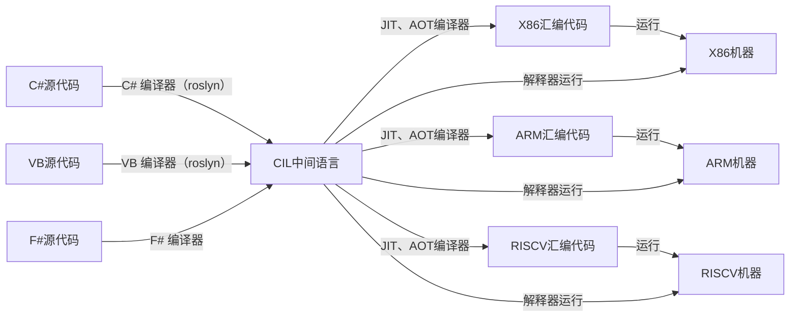

# .Net架构

## .Net标准和规范

- [标准和规范](https://learn.microsoft.com/zh-cn/dotnet/fundamentals/standards)
- [CLI标准](https://ecma-international.org/publications-and-standards/standards/ecma-335/)
- [CLI标准-PDF](https://www.ecma-international.org/wp-content/uploads/ECMA-335_6th_edition_june_2012.pdf)

## .Net实现

[.Net的几种实现](https://learn.microsoft.com/zh-cn/dotnet/fundamentals/implementations)

- [.NET （以前叫.Net Core）](https://learn.microsoft.com/zh-cn/dotnet/fundamentals/)：新的.NET的跨平台实现
- [.NET Framework](https://learn.microsoft.com/zh-cn/dotnet/framework/)：原始.NET实现
- [Mono](https://www.mono-project.com/docs/)：.NET跨平台实现（小型运行时）
- [通用 Windows 平台 (UWP)](https://learn.microsoft.com/zh-cn/windows/uwp/)：通用 Windows 平台

## 整体流程

## 解释器

- [CoreCLR Interpreter](https://github.com/dotnet/runtime/tree/main/src/coreclr/interpreter)：CoreCLR的解释器
- [Mono Interpreter](https://github.com/dotnet/runtime/tree/main/src/mono/mono/mini/interp)：Mono的解释器

## JIT编译器

- [RyuJIT](https://github.com/dotnet/runtime/tree/main/src/coreclr/jit)：CoreCLR官方JIT编译器，位于runtime代码仓库的src/coreclr/jit目录中。
- [Mono JIT](https://github.com/dotnet/runtime/tree/main/src/mono/mono/mini)：Mono的JIT编译器，支持的平台多，但是性能低于RyuJIT。
- [LLILC](https://github.com/dotnet/llilc)：基于LLVM的JIT编译器，目前已经停止维护。

## AOT编译器

- [​NativeAOT](https://github.com/dotnet/runtime/tree/main/src/coreclr/nativeaot)：CoreCLR官方AOT编译器（以前叫CoreRT），位于runtime代码仓库的src/coreclr/nativeaot目录中。它会调用RyuJIT编译器进行具体编译操作。
- [Mono AOT](https://github.com/dotnet/runtime/tree/main/src/mono/mono/mini)：Mono的AOT编译器（和JIT编译器同一个目录）
- [Crossgen2 (R2R AOT)](https://github.com/dotnet/runtime/tree/main/src/coreclr/tools/aot)：把一部分CIL编译器成机器码，加快启动速度，但是不完整编译。
- 试验项目：
  - [​NativeAOT-LLVM（试验阶段）](https://github.com/dotnet/runtimelab/tree/feature/NativeAOT-LLVM)：基于LLVM的AOT编译器，目前只支持生成WebAssembly代码
  - [​NativeAOT-Mint（试验阶段）](https://github.com/dotnet/runtimelab/tree/feature/NativeAOT-Mint)：使用Mono解释器增强的NativeAOT编译器的动态代码创建功能。
  - https://github.com/dotnet/runtimelab/tree/feature/NativeAOT
  - https://github.com/dotnet/runtimelab/tree/feature/nativeaot-android
