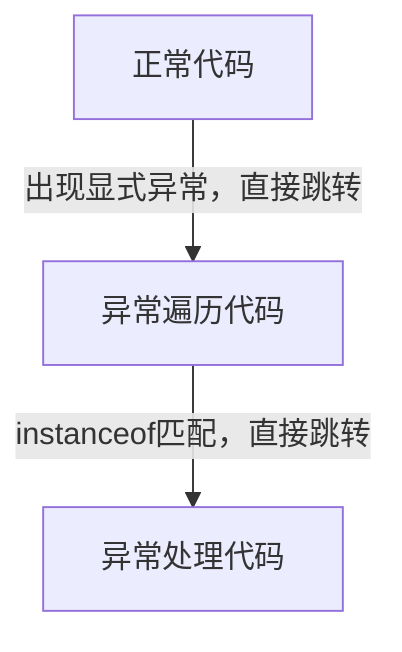
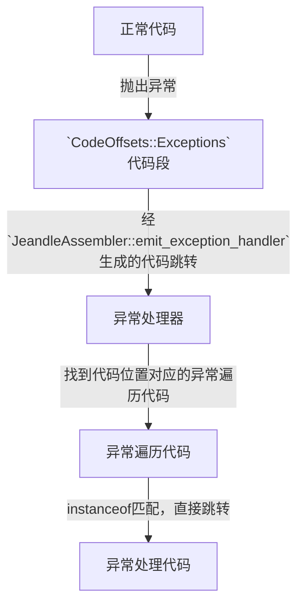
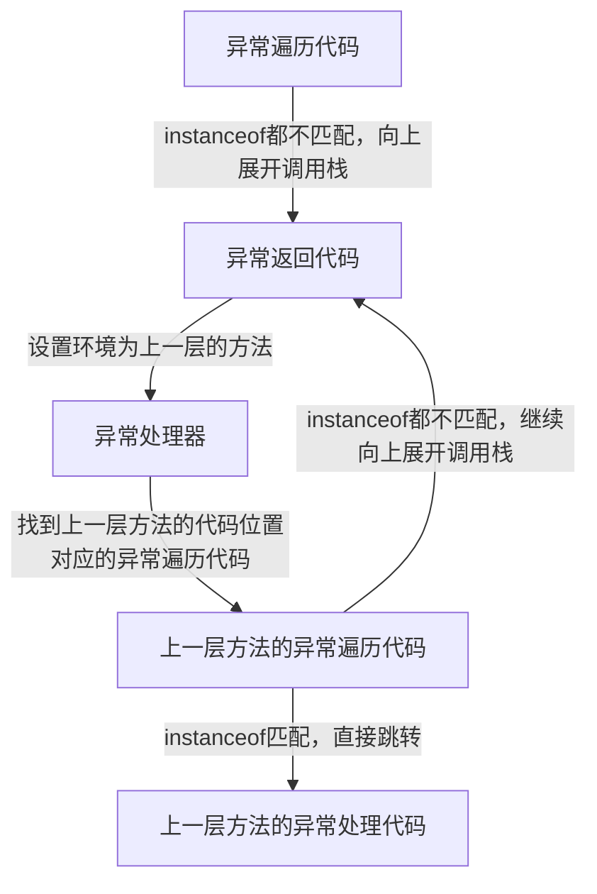

# 异常处理总结

## 代码类型

### 正常代码

正常流程的代码被jeandle编译生成的代码。

### 异常处理代码

**catch块里面的代码**被jeandle编译生成的代码。
和正常代码一起放在当前方法的代码中，不共用。

### 异常遍历代码

负责判断异常的类型。**catch语句的异常类型**被jeandle编译生成**调用`instanceof`**的代码。
**在`JeandleAbstractInterpreter::dispatch_exception_to_handler`函数中生成。**
和正常代码、异常代码一起放在当前方法的代码中，不共用。
每个可能抛出异常的代码位置（PC、IP），都有一段`异常遍历代码`与之对应。

### 异常处理器（用于异常表搜索的routine）

负责搜索`抛出异常的代码位置（PC、IP）`对应的`异常遍历代码`的代码位置。
在`JeandleRuntimeRoutine::generate_exception_handler`生成。被所有方法共用。

### 异常返回代码（向上展开unwind处理）

当前方法不能处理异常时，会向上展开（unwind）调用栈，到上层方法处理异常。
在`JeandleRuntimeRoutine::install_exceptional_return`、`JeandleRuntimeRoutine::generate_exceptional_return`函数中生成。

## 运行流程

## 显式调用流程

`athrow`字节码、`checkcast`字节码、空检测、边界检测等情况下，会显式产生异常。
这时候会直接跳转到`异常遍历代码`（这是编译器直接生成的跳转代码，详见`athrow`、`checkcast`等字节码的编译流程），使用`instanceof`判断异常类型，
类型匹配则跳转到`异常处理代码`，否则继续向上展开调用栈。

### 隐式调用流程

异常处理器（用于异常表搜索的routine）会被`JeandleCompiledCode::finalize`中install到`CodeOffsets::Exceptions`代码段中。
虚拟机运行中生成异常时，会跳转到`CodeOffsets::Exceptions`段的代码，然后异常处理器会搜索该代码位置对应的异常遍历代码，跳转至异常遍历代码。
异常遍历代码会判断异常类型，类型匹配则跳转到`异常处理代码`，否则继续向上展开调用栈。

### 异常返回流程（向上展开unwind处理流程）

上面两个流程中，无法处理异常时，会向上展开（unwind）调用栈，到上层方法处理异常。

